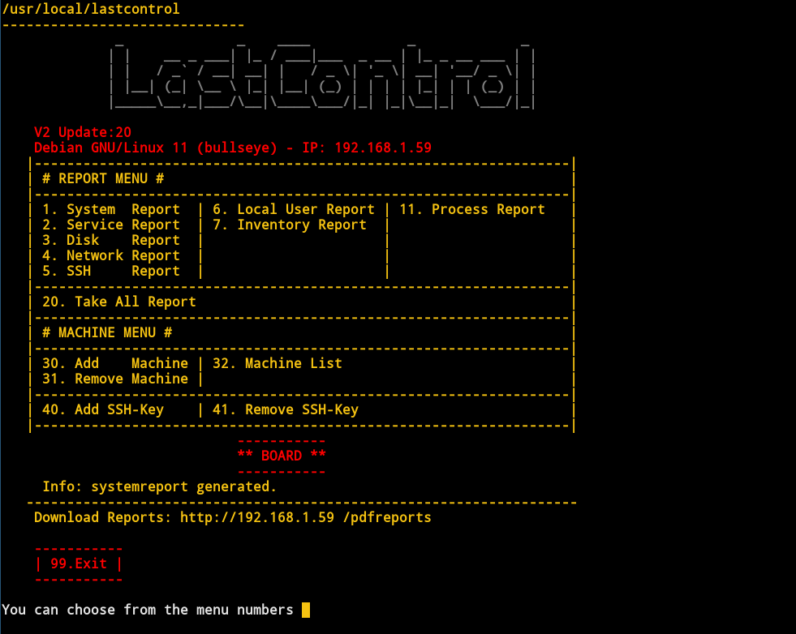
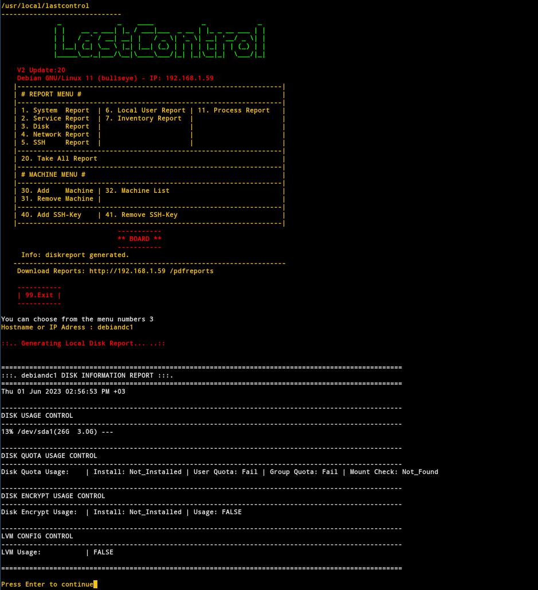
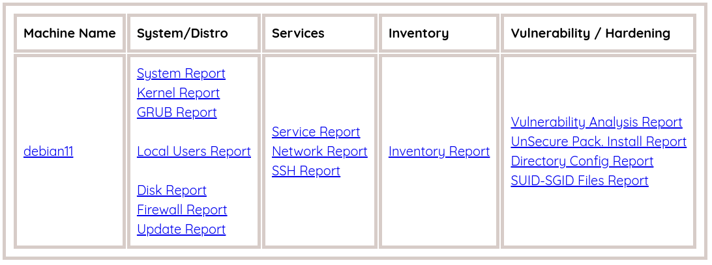
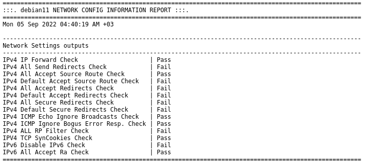

 

LastControl performs health and hardening checks on the system. 
It outputs machine-specific reports to the screen and publishes them from the Web Page in bulk, and saves them as PDFs. 
 
**Compatible servers and clients;**  
Debian, Ubuntu, Centos, RedHat, Fedora, Oracle Linux, Rocky Linux 

 

All checks are made according to CIS Benchmark bulletins. 
https://www.cisecurity.org/

---

---

---

---

---

## Installation and Documentation
[LastControl Handbook](https://github.com/eesmer/LastControl/blob/main/LastControl-HandBook.md)
