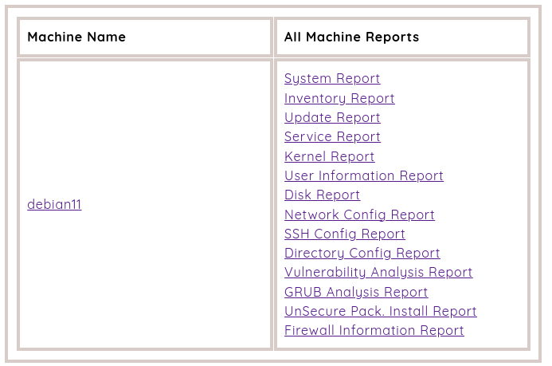

 

LastControl is a control tool that performs system checks and presents the outputs of these checks as a web page report. 
With LastControl, you can control and report such as automatic and periodic system and network configuration.
 
**distributions that are compatible and tested as a server and clients:**  
Debian, Ubuntu, Centos, RedHat, Oracle Linux, Rocky Linux 

 

All checks are made according to general and CIS security and hardening checks. 
https://www.cisecurity.org/

---

---

---

## Installation and Documentation
[LastControl Handbook](https://github.com/eesmer/LastControl/blob/main/LastControl-HandBook.md)
