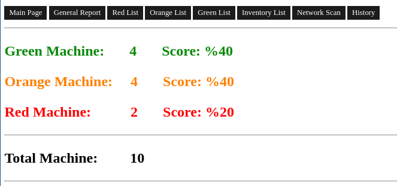

<br>

LastControl is a work around for health checking on linux machines. <br>
**distributions that are compatible and tested as a server and clients:** <br>
Debian, Ubuntu, Centos, RedHat, Oracle Linux, Rocky Linux

## Features
##### 1- Checks system, system integrity and inventory
- Takes out inventory
  - Adds to the report if there is an inventory change
- Checks for updates
- Controls listening and established connections
- Looks at running services and load status
- Ram, swap and disk uses (S.M.A.R.T check for disk)
- Controls local user management (local user,limit and sudo privileges)
##### 2- Checks configurations according to hardening policies. https://www.cisecurity.org/
- Controls system, network and access (ssh) settings
##### 3- Checks Vulnerability
- Checks for kernel-based CVE
- Checks log4j usage
##### 4- Scans the network
- It only performs a fast scan with nmap on the subnet.
<br>
All these outputs with a web page;<br>
It shows the reports on a single screen by categorizing the machines as 'red' 'green' and 'orange' and General Report.

## Requirements
It works in Debian environment. Desktop environment is not required.

### Installation and Usage
Use LastControl with root user
```sh
$ wget https://raw.githubusercontent.com/eesmer/LastControl/main/lastcontrol-installer.sh
$ bash lastcontrol-installer.sh
```


<br>

**Access Page:** http://$LASTCONTROL_IP

#### add/remove machine
```sh
$ vim /usr/local/lastcontrol/hostlist
```
In this file, one machine is written per line.<br>
Each machine must be written with the machine name.
(example: debianhost1, client_99) <br>
<br>
LastControl should be able to reach the target machine by hostname.
If you cannot use DNS;<br>
Add the target machine to the **/etc/hosts file** on the LastControl machine.

##### install ssh-key (lastcontrol.pub)
LastControl uses ssh-key to access machines. The ssh-key file is created during the installation of the LastControl machine.<br>
You can install the LastControl ssh-key file as follows to access the added machines.
```sh
$ wget http://$LASTCONTROL_IP/lastcontrol/lastcontrol.pub
$ cat lastcontrol.pub >> /root/.ssh/authorized_keys
```

#### How it works
It runs periodically every 3 hours.<br>
If you want to trigger the operation manually;<br>
```sh
$ systemctl restart lastcontrol.service
```
