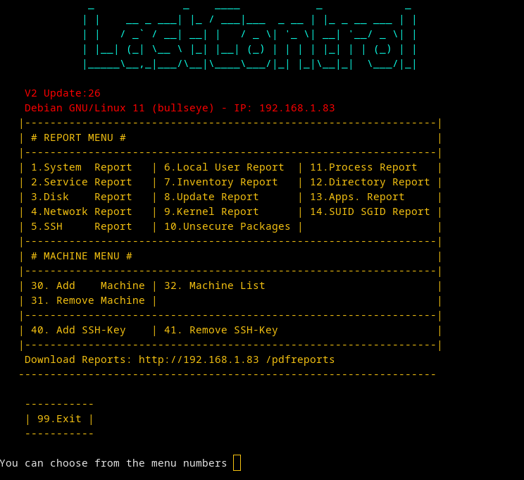

<br>


LastControl performs health and hardening checks on the system.<br>
It outputs machine-specific reports to the screen and publishes them from the Web Page in bulk, and saves them as PDFs.<br>
<br>
**Compatible servers and clients;** <br>
Debian, Ubuntu, Centos, RedHat, Fedora, Oracle Linux, Rocky Linux<br>

<br>

All checks are made according to CIS Benchmark bulletins.<br>
https://www.cisecurity.org/

---

### LastControl Install
#### LastControl Edge
Edge runs locally on the server and produces reports.<br>
You can create and read reports with the CLI provided by Edge.<br>
##### Usage
```bash
wget https://esmerkan.com/lastcontrol/edge/lastcontrol
chmod +x lastcontrol
./lastcontrol
```
```bash
./lastcontrol --help
```

```bash
wget https://raw.githubusercontent.com/eesmer/LastControl/master/installer/lastcontrol-installer.sh
```
```bash
bash lastcontrol-installer.sh
```
---



---


---


