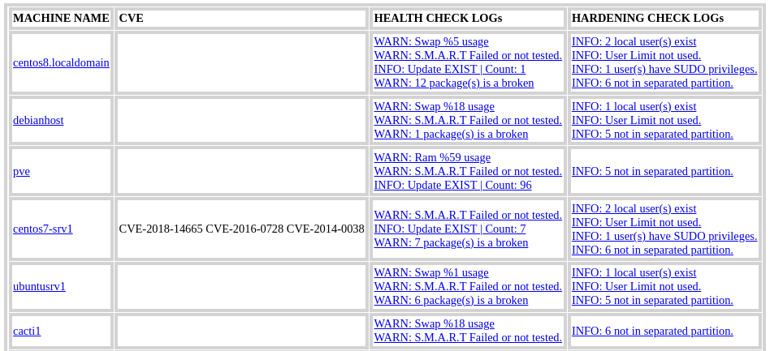
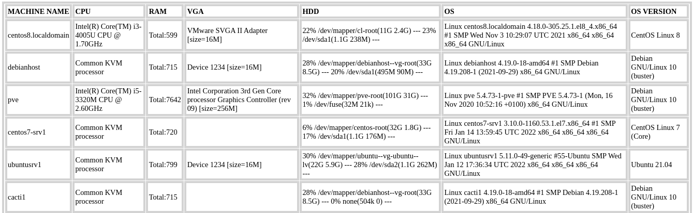

 

LastControl is a work around for health checking on linux machines.  
**distributions that are compatible and tested as a server and clients:**  
Debian, Ubuntu, Centos, RedHat, Oracle Linux, Rocky Linux

## Features
##### 1- Checks system, system integrity and inventory
- Takes out inventory
  - Adds to the report if there is an inventory change
- Checks for updates
- Controls listening and established connections
- Looks at running services and load status
- Ram, swap and disk uses (S.M.A.R.T check for disk)
- Controls local user management (local user,limit and sudo privileges)
##### 2- Checks configurations according to hardening policies. https://www.cisecurity.org/
- Controls system, network and access (ssh) settings
##### 3- Checks Vulnerability
- Checks for kernel-based CVE
- Checks log4j usage
##### 4- Scans the network
- It only performs a fast scan with nmap on the subnet.

 

All these outputs with a web page; 
It shows the reports on a single screen by categorizing the machines as 'red' 'green' and 'orange' and General Report.

 

---

 

---

## for Installation and Usage
[LastControl Handbook](https://github.com/eesmer/LastControl/blob/main/LastControl-HandBook.md)

