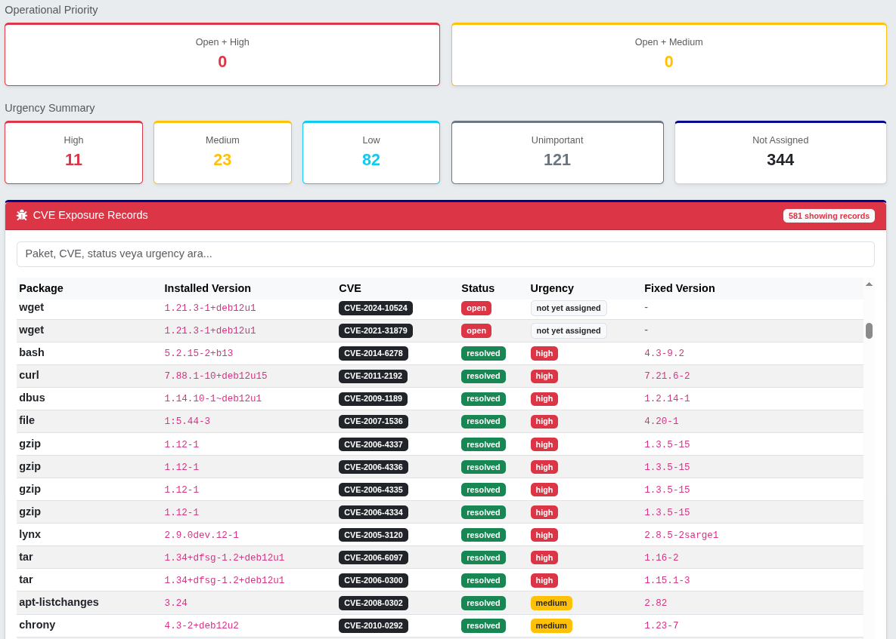

## Lightweight Linux Fleet Reporting & Telemetry Platform


---

LastControl is a reporting and telemetry platform that runs on Linux machines using a TLS-enabled agent.
Unlike large-scale enterprise monitoring systems, it aims to provide a fast-to-deploy, scalable, minimal, and easy-to-understand infrastructure.

### Key Features
- TLS-encrypted communication using socat
- Certificate-based client authorization
- Web UI
- Historical telemetry and Historical reporting
- Randomized reporting timers

 <br>

---

### Reports and Dashboard Pages
- Inventory Report
- Update Report
- Installed Packages
- Open Ports
- Local Users
- Roles
- System Load
- RRD Graphics
- CVE Page Associated with Installed Packages
- Vulnerability Exposure
- Historical Reports

#### Supported Distros
- Ubuntu
- RHEL / Rocky / Alma
- Debian
- Oracle Linux

##### Servers
- Debian
- Ubuntu

---

### Vendor Security Matching

LastControl does not compare only package versions. <br>
Instead it correlates installed packages with official vendor security advisories.
This approach significantly reduces false positives and follows the security status published by distribution vendors.

#### Supported security sources;
- [Debian Security Tracker](https://security-tracker.debian.org/)
- [Ubuntu OVAL](https://security-metadata.canonical.com/oval/)
- [Red Hat Security Data API](https://access.redhat.com/hydra/rest/securitydata)

#### Future vendors
- Oracle Linux
- SUSE



---

### Installation
```
wget https://raw.githubusercontent.com/eesmer/LastControl/refs/heads/main/LastControl-ServerInstaller.sh
```
```
bash LastControl-ServerInstaller.sh
```

### Access to Web Interface
```
http://SERVER_IP
Username: admin
Password: lastcontrol
```
### Agent Installation
The server generates a custom installer:
```
http://SERVER_IP/download-agent
```
```
/usr/local/lastcontrol/dist/lastcontrol-agent_installer.sh
```
Copy the installer to the target machine and run:
```
bash lastcontrol-agent_installer.sh
```
The agent will:
- Install required dependencies
- Install reporting scripts
- Install TLS certificates
- Configure systemd timer
- Start periodic reporting

---
