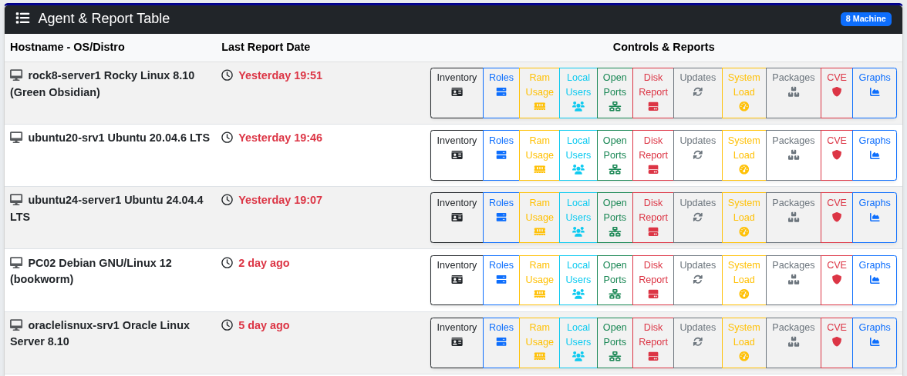

## Linux Fleet Reporting & Telemetry Platform


---

## Description

LastControl is a reporting and telemetry platform that runs on Linux machines using a TLS-enabled agent. <br>
Unlike large-scale enterprise monitoring systems, it aims to provide a fast-to-deploy, scalable, minimal, and easy-to-understand infrastructure.
LastControl provides multiple reporting pages including inventory, software updates, installed packages, users, services, networking, historical telemetry and vendor-aware CVE exposure.

- Lightweight agent-based reporting platform
- TLS-secured communication
- Vendor-aware CVE intelligence
- Historical inventory and telemetry
- Web dashboard
- Multi-distribution support

#### Supported Distros
- Ubuntu
- RHEL / Rocky / Alma
- Debian
- Oracle Linux

---

### Vendor Security Matching

LastControl does not compare only package versions. <br>
Instead it correlates installed packages with official vendor security advisories.
This approach significantly reduces false positives and follows the security status published by distribution vendors.

#### Supported security sources;
- [Debian Security Tracker](https://security-tracker.debian.org/)
- [Ubuntu OVAL](https://security-metadata.canonical.com/oval/)
- [Red Hat Security Data API](https://access.redhat.com/hydra/rest/securitydata)

#### Future vendors
- Oracle Linux
- SUSE

---

## Installation
The installation has been tested on **Debian 13 Trixie**. Use the latest version of **Debian** for the server. <br>
(Server installation has not been tested on Ubuntu. You can try it if you like.) <br>
```
wget https://raw.githubusercontent.com/eesmer/LastControl/refs/heads/main/LastControl-ServerInstaller.sh
```
```
bash LastControl-ServerInstaller.sh
```
### Access to Web Interface
```
http://SERVER_IP
Username: admin
Password: lastcontrol
```
### Agent Installation
The server generates a custom installer:
```
http://SERVER_IP/download-agent
```
```
/usr/local/lastcontrol/dist/lastcontrol-agent_installer.sh
```
Copy the installer to the target machine and run:
```
bash lastcontrol-agent_installer.sh
```
The agent will:
- Install required dependencies
- Install reporting scripts
- Install TLS certificates
- Configure systemd timer
- Start periodic reporting

---

## Screenshots


---


---

## Project Status
#### Roadmap & Release Plan
| Phase | Status | Description | Version/Status
|--------|--------|-------------|------------------|
| Phase 1 | Completed | Core reporting platform | v1.0 - Released |
| Phase 1.5 | In Progress | Security Intelligence & Vendor-aware CVE Matching | v1.5 - In Progress |
| Phase 2 | Planned | Task Runner & Remote Execution | v2.0 - Planned |
| Phase 3 | Planned | Policy Compliance | v3.0 - Planned |
| Phase 4 | Planned | Enterprise Features | v4.0 - Planned |

#### Progress
| Phase 1                    | Phase 1.5                           | Phase 2                           |
|----------------------------|-------------------------------------|-----------------------------------|
| [x] Agent architecture     | [x] Debian CVE matcher              | [ ] Task Runner
| [x] TLS communication      | [x] Ubuntu CVE matcher              | [ ] Job Scheduler
| [x] Inventory collection   | [x] RHEL family CVE matcher         | [ ] Remote Command Execution
| [x] various system reports | [x] Security data cache             | [ ] Job History
| [x] Historical database    | [ ] Multi-distribution validation   | [ ] Result Viewer
| [x] Reporting engine       | [ ] Documentation review            |
| [x] Web dashboard          | [ ] Final stabilization             |

---

See [CHANGELOG.txt](docs/CHANGELOG.txt) for the complete release history.
