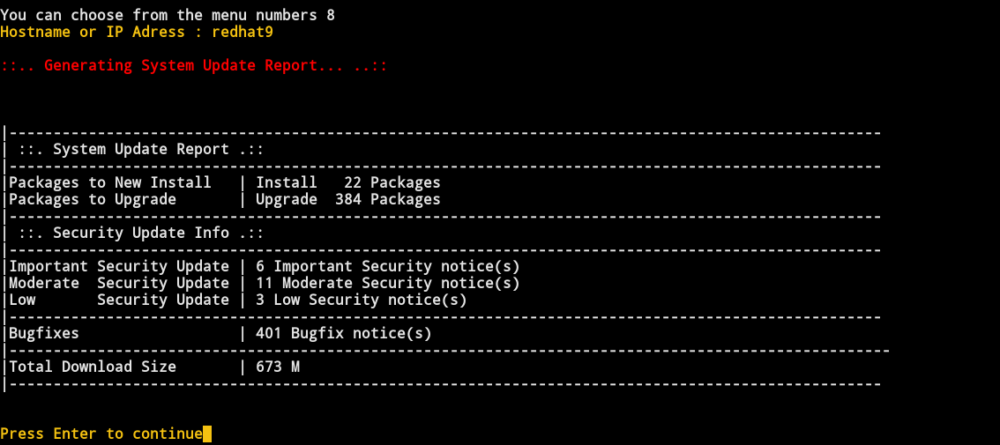

<br>


LastControl performs health and hardening checks on the system.<br>
It outputs machine-specific reports to the screen and publishes them from the Web Page in bulk, and saves them as PDFs.<br>
<br>
**Compatible servers and clients;** <br>
Debian, Ubuntu, Centos, RedHat, Fedora, Oracle Linux, Rocky Linux<br>

<br>

All checks are made according to CIS Benchmark bulletins.<br>
https://www.cisecurity.org/

---

### LastControl Install
```bash
# wget https://raw.githubusercontent.com/eesmer/LastControl/master/installer/lastcontrol-installer.sh
# bash lastcontrol-installer.sh
```
---


---



---


---


