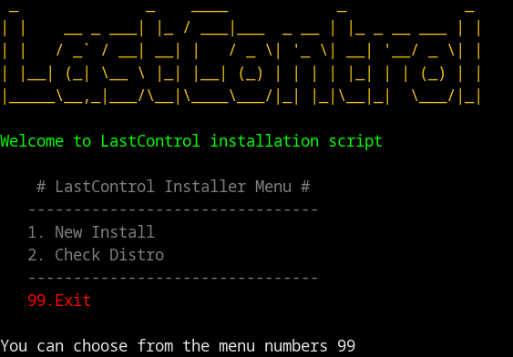
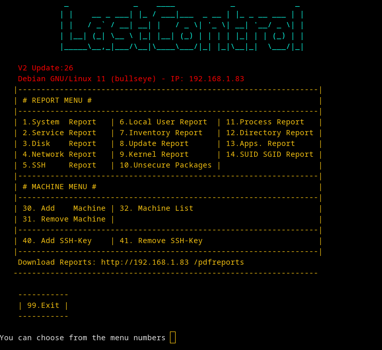
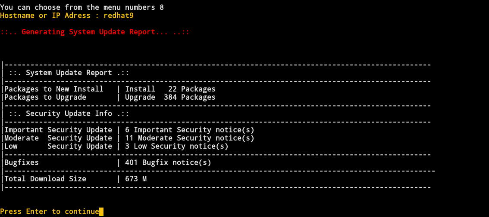

## LastControl Install
### LastControl

---

```bash
wget https://raw.githubusercontent.com/eesmer/LastControl/master/installer/server/lastcontrol-installer.sh
```
```bash
bash lastcontrol-installer.sh
```
---



You can check the support of the installation by checking the distro from the Installer menu.<br>
You can install LastControl in the environment using the New Install menu. <br>
Then you can get reports from your local or remote servers with Manager.<br>

---



---



---
